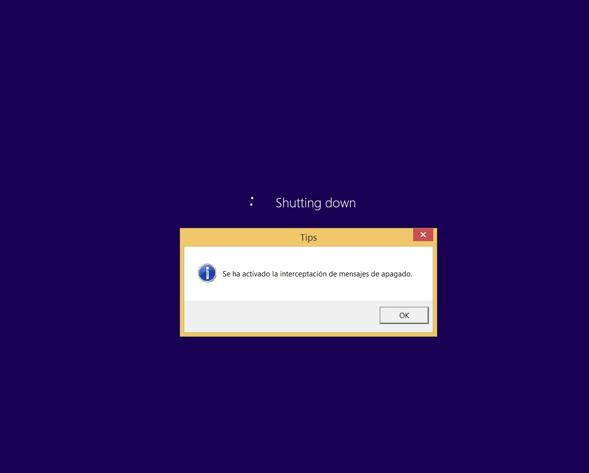

# HookShutdown

## Overview

Este es un programa que demuestra cómo enganchar las tablas de importación e importación retardada del proceso winlogon.exe para interceptar llamadas a funciones de la API de apagado y así ejecutar código personalizado a nivel de sistema antes del apagado. El programa actualmente hace esto mostrando un cuadro de mensaje en el momento del apagado como se muestra a continuación:

## Etapas de implementación

1. **Iniciar un proceso e inyectar una DLL en el proceso Winlogon.**

- Dado que el proceso Winlogon es un proceso de nivel de sistema, es necesario que el proceso de inyección se inicie con privilegios de administrador y tenga habilitado el privilegio SeDebugPrivilege para poder inyectar en un proceso de nivel de sistema.

- Obtener el PID del proceso Winlogon mediante la enumeración de procesos. También se puede determinar la sesión de un proceso durante este paso, ya que puede haber varios procesos Winlogon en el sistema en un momento dado.

- Abrir el proceso Winlogon con el indicador PROCESS_ALL_ACCESS.

- Asignar memoria en el proceso Winlogon objetivo y escribir la ruta absoluta de la DLL que se va a inyectar.

- Iniciar la inyección remota de la DLL utilizando un hilo remoto cuya función de inicio es LoadLibraryA(W), pasando como argumento la dirección de la ruta de la DLL a inyectar en el proceso objetivo.

2. **Hacer hook en la tabla de importaciones y la tabla de importaciones tardías en la función de entrada DllMain de la DLL.**

- En Windows 7 x86, el proceso Winlogon hace referencia a la función ExitWindowsEx del módulo User32 en la tabla de importaciones.

- En Windows 10 1809 x64, el proceso Winlogon hace referencia a la función ExitWindowsEx del módulo User32 en la tabla de importaciones tardías. Por lo tanto, es necesario reparar ambas tablas.

3. **Redirigir la función hacia una función personalizada y escribir el código de funcionalidad en esa función personalizada.**

- Después de realizar pruebas, se ha observado que el proceso Winlogon llama dos veces a la función ExitWindowsEx. La primera llamada se utiliza para enviar mensajes de cierre de sesión o apagado al proceso del escritorio, y los procesos de usuario pueden realizar las acciones necesarias, como guardar el contenido que sea necesario. Una vez que todos los procesos hayan terminado su trabajo, la primera llamada a ExitWindowsEx devuelve TRUE; de lo contrario, devuelve FALSE.

- Si la primera llamada a ExitWindowsEx tiene éxito, significa que todos los procesos de escritorio han aceptado el apagado o la salida de sesión. En este caso, se realizará una segunda llamada a ExitWindowsEx antes de destruir los procesos de escritorio. Antes de esta segunda llamada, es necesario tener en cuenta que los procesos de escritorio se han destruido y, por lo tanto, si se desea mostrar una ventana de programa, se debe realizar en el escritorio "WinSta0\winlogon" especificando que el lpDesktop de STARTUPINFOA(W) apunte a esta cadena.

  *Con el conocimiento anterior, se puede interceptar el proceso antes de la segunda llamada a ExitWindowsEx en el proceso Winlogon, mostrando un cuadro de diálogo para informar al usuario de que se realizará un apagado o mostrando algún otro mensaje. Dado que la segunda llamada a ExitWindowsEx solo se realiza si la primera llamada devuelve TRUE, esto indica que los procesos de usuario ya tienen conocimiento y han manejado cualquier archivo sin guardar. Una vez que la primera llamada a ExitWindowsEx tiene éxito, el escritorio de Windows ya se encuentra en la ubicación "WinSta0\winlogon", por lo que al llamar a CreateProcessAsUserA(W), es necesario especificar el escritorio correspondiente.*
  
4. **Es importante tener en cuenta que nuestra DLL se ejecuta en el contexto del proceso de sistema y, al mostrar un mensaje, es preferible que el proceso tenga los privilegios mínimos necesarios. Por lo tanto, utilizamos CreateProcessAsUserA(W) para crear un nuevo proceso.**

Después de interceptar la segunda llamada a ExitWindowsEx, se abre el proceso actual para copiar el token y modificar el nivel del token. Sin embargo, al abrir el proceso actual, el programa falla. Por lo tanto, se ha decidido crear y guardar un token en la función DllMain, que se utilizará al llamar a CreateProcessAsUserA(W).

Después de llamar a ExitWindowsEx dos veces, el proceso winlogon llama al proceso wininit para ejecutar el proceso de apagado a través de ntdll!NtShutDownSystem. En Windows 10 1809 x64, se descubrió que wininit realiza una tercera llamada a la función ExitWindowsEx. Originalmente, se intentó realizar una inyección de hilo remoto en el proceso wininit, pero falló con el código de error 8, que indica falta de recursos de memoria para procesar este comando.

## Nota

Después de llamar a ExitWindowsEx dos veces, el programa winlogon se cierra. Si se elige cerrar la sesión del usuario actual, el winlogon actual finaliza y se inicia un nuevo winlogon, sin la inyección de nuestra biblioteca dinámica. Por lo tanto, se puede implementar un inyector como un proceso de servicio en segundo plano, que enumera los procesos winlogon y realiza la inyección DLL. También se puede realizar un Hook en el proceso wininit. Además, se puede escuchar el mensaje de ventana WM_QUERYENDSESSION en el proceso del escritorio, o registrar una función de devolución de llamada mediante RegisterServiceCtrlHandlerA(W) en un proceso de servicio para manejar las solicitudes SERVICE_CONTROL_SHUTDOWN.
